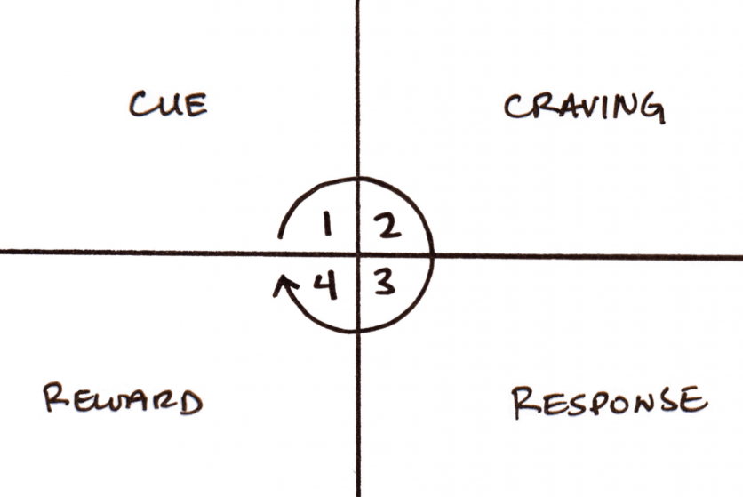

As described in an earlier post, I've been using James Clear's [Atomic Habits](https://jamesclear.com/atomic-habits) as a tool over the last few months.

The focus on process and incremental gains has been useful, and leaves one with a fairly clear set of steps to work through – unlike many self-improvement books. It got me to thinking, though, _how could the same approach be applied to a team or company_?

<!-- excerpt -->

The core principles of the book are based on the the Cue&nbsp;/&nbsp;Craving&nbsp;/&nbsp;Response&nbsp;/&nbsp;Reward cycle[^1].

In particular, to build a habit:
1. make it obvious
1. make it attractive
1. make it easy
1. make it satisfying

There's nothing here that can't apply to a group of people as much as to an individual.

To experiment with this, I tried to set up the Teespring engineering team with a new atomic habit.

## The habit: tech debt with every PR
Like any company with a nine year-old codebase, there are areas of Teespring's codebases that suffer under tech debt. Partially-deprecated services, contorted logic, misleading comments, duplicated functionality, flaky tests, non-idiomatic patterns, ... the usual.

We already do pretty well at tackling big projects which structurally address tech debt. When we work on any significant project, we naturally have a discussion about the best way to implement the change in such a way as to avoid problematic areas, leave things cleaner than we found them, and deprecate and remove legacy code.

However, we were failing on a smaller scale.

The progress we made in big sweeping refactors and replacement projects was _partially_ undone by pernicious little slivers of tech debt creeping in with every change we made. Shamefully, my approach before was basically to ask the team to "try harder" not to introduce tech debt. Try harder they did, but we needed a better approach. We needed something that became a core part of our engineering culture, rather than something that people had to put effort in to remember to do.

So, we came up with a new habit to instill within the engineering team working on our most problematic codebase.

> In every pull request you should address a specific piece of tech debt and call it out in the PR description.

## The habit loop
##### 1. Make it obvious
We changed the [pull request template](https://help.github.com/en/github/building-a-strong-community/creating-a-pull-request-template-for-your-repository) for our repository to remind authors to tackle even a little bit of tech debt in their PR.

##### 2. Make it attractive
This was easy. In some companies, I've seen tech debt clean-up viewed with apathy and dismay. Not so at Teespring.

I think partly because we feel the needling of tech debt every time we make a change, and partly because we have a fantastic team, everyone is ready, able, and excited to solve the challenge of tech debt: it was innately attractive.

##### 3. Make it easy
We created a wiki page which listed a few ideas for types of tech debt to tackle, such as:

- fixing a flaky test
- fixing a typo
- removing a useless comment
- fixing an entry from our `.rubocop_todo.yml`
- finding a piece of tech debt and creating an issue for it in our shared Jira project

As mentioned above, we also created a new Jira project to collect specific pieces of tech debts for others to pick up and fix in the future. This removed all barriers for a PR author to identify something they could usefully do to meet the criteria.

The emphasis here was that the **amount** or **complexity** of the tech debt was irrelevant. You just had to do **more than zero**.

##### 4. Make it satisfying
Every Friday, I call out in our engineering Slack channel how many PRs had indeed fixed some tech debt, with special mentions for people who went above and beyond.

I haven't **yet** started calling people out who didn't follow the rules, preferring positive reinforcement.

## Does it work?
We haven't had a perfect week yet: every week there's been one or two PRs that didn't follow the rules. But the percentage of conformant PRs is high – in the 90s – and there's no pattern of a particular person not playing ball.

In addition to the tangible benefits of tech debt being paid down monotonically, this change has given our conversations around tech debt a much more solution-focussed tone, with clear and simple steps we all know we need to follow.

I'm looking forward to find some new habits to build in the organisation once we get this tech debt one locked in!

[^1]: the Habit Loop sketch is from [James Clear](https://jamesclear.com/habit-triggers).
