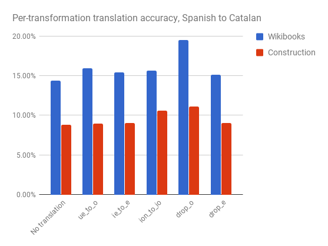
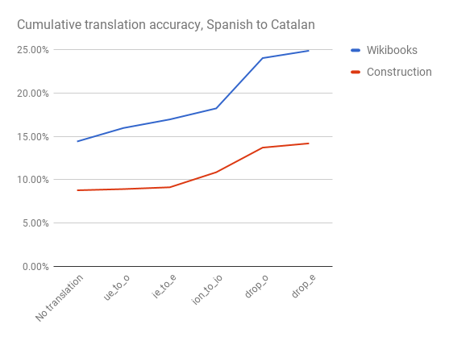

I'm currently learning Catalan and Spanish, and am reminded every day of the languages' [shared ancestor](https://en.wikipedia.org/wiki/Romance_languages) by how often they share similar (or identical) words.

For example, it's easy to deduce that _introducción_ (in Spanish) means the same as _introducció_ (in Catalan), or that _respuesta_ and _resposta_ are the same thing.

In fact, when you look at the Spanish and Catalan words next to each other, it seems that the same kinds of transformations crop up again and again: consonants becoming repeated, vowels being dropped off the ends of words, stressed vowels changing in predictable ways, ...

Of course, the languages are very different and often use completely distinct words, but it got me thinking: how reliably can we guess a Catalan word from a Spanish one, using just a small set of simple transformations?

Well, tl;dr, you can make surprisingly informed guesses with very few rules!

I put together a little test in [Elixir](https://elixir-lang.org/) to see which of these word transformations are more or less useful in guessing a Catalan word from a Spanish one.

The two series represent the two data sources I was working with: [Wikibooks](https://es.wikibooks.org/wiki/Catal%C3%A1n/Diccionario_castellano-catal%C3%A1n) and this [lexicon of construction terminology](http://cit.iec.cat/LMC/default.asp?opcio=0). Please excuse the an&#230;mic and peculiar data sources: it was nigh on impossible to find a good mapping from Spanish words to Catalan, or vice versa. More on that later.

## Transformations
In the "No translation" base case (applying no transformations whatsoever), we can see that somewhere around 10–12% of Spanish words are already exactly equivalent to their Catalan counterparts (depending on data set).

I then applied [these five transformations](https://github.com/goodgravy/translate/blob/c5ea1dc90a709cd5dbfa77d1f39a03c818ee536f/lib/translate/transformers.ex#L5-L9) and tested how much of a difference they made:

* `ue_to_o`: replace _ue_ with _o_ (e.g. _respuesta_ &#8594; _resposta_)
* `ie_to_e`: replace _ie_ with _e_ (e.g. _siento_ &#8594; _sento_)
* `ion_to_io`: replace _ión at the end of a word with _ió_ (e.g. _introducción_ &#8594; _introducció_)
* `drop_o`: get rid of _o_ at the end of a word (e.g. _agosto_ &#8594; _agost_)
* `drop_e`: get rid of _e_ at the end of a word (e.g. _verde_ &#8594; _verd_)

Some of the transformations (e.g. `ie_to_e`) are only marginally effective, whereas others are surprisingly useful (e.g. `drop_e` letters which boosts similarity by 4 or 5% in absolute terms).

Applied one after another, these five simple transformations increase the word similarity from 14% to 25% for the Wikibooks data, and from 9% to 14% for the construction data!

## How reliable are these results for real texts?
The main challenge with this experiment was getting my hands on clean data – as is often the case.

The Wikibooks data is very limited, only containing about 700 words and lots of proper nouns. As for the construction lexicon, firstly it contains lots of multi-word phrases (on which this word-by-word transformation is ineffective) and secondly, it naturally includes **lots** of trade jargon.

Also, it's notable that neither data source includes verb conjugations, which I think would be rich pickings for the vowel transformation rules. It's **very** common for Spanish irregular verbs to smush a stressed vowel into a pair of vowels.

## Elixir as an implementation language
Originally, I wanted to use Elixir for two reasons:

1. I've greatly enjoyed using it for work and play before, and want to keep my hand in
1. Pattern matching sits at the very core of the language philosophy and I was hoping it would be convenient for this sort of pattern matching task

In reality, #1 has proven to be true. I love the language, tooling, and community, and I'm looking forward to using it even more.

\#2 turned out **not** to apply. The vast majority of the time I spent was in looking for and subsequently cleaning the data. The majority of the Elixir code I wrote was to handle the application of the transformations, and measuring accuracy in a convenient way.

The actual transformations themselves were literally [those five lines of code](https://github.com/goodgravy/translate/blob/c5ea1dc90a709cd5dbfa77d1f39a03c818ee536f/lib/translate/transformers.ex#L5-L9). Testament to the power of Elixir, but not really a game-changing choice for how tidy this part of the implementation was.

## Next steps to try
I kept this short and sweet as a starting point, but there's lots more to experiment with here if I have a chance:

* more transformations (e.g. I just noticed that `~r/ado$/` &#8594; _at_ is a common pattern)
* scrape [verbs.cat](http://www.verbs.cat/en/) and conflate with [Fred Jehle's Spanish conjugations](http://users.ipfw.edu/jehle/VERBLIST.HTM) in order to test the transformations on conjugated verbs
* implement a statistic based on the [Levenshtein edit distance](https://en.wikipedia.org/wiki/Levenshtein_distance) rather than exact matches
* track which transformations **harm** accuracy along with the benefits they bring – what's the best order to apply the transformations in to prevent "cannibalisation"?
* could a machine learning approach be used, where it learns a set of rules from the training data rather than me ham-fisting them together?
* &laquo;your idea here: [digues-me!](https://twitter.com/goodgravy)&raquo;

## Disclaimer
Obviously, I'm not promoting this as a good or sensible way to translate language. However, being able to make informed guesses what a Catalan word might be when I know the Spanish equivalent has been incredibly helpful in the real world.

As it happens, just yesterday a Catalan friend – who doesn't speak Spanish day-to-day – was telling us that while he was on vacation in the south, he had referred to bread as _pano_, rather than _pan_. He had taken the Catalan word _pa_ and mis-applied the trailing-O rule (the transformation that I found to be most effective). It goes to show that even native speakers have a set of imperfect heuristics  for how to get from one language to another!
