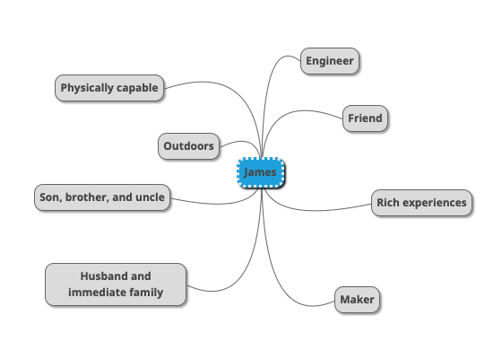
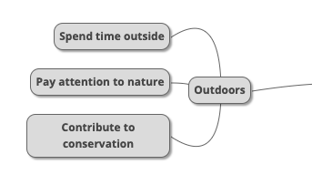
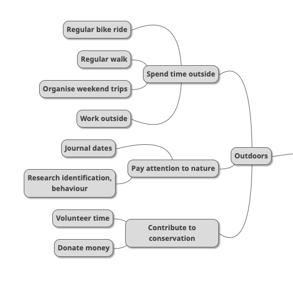
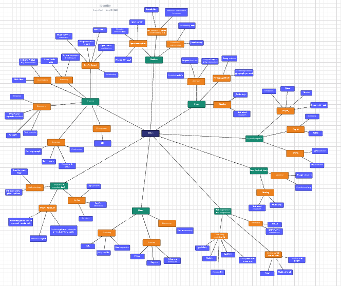

[Atomic Habits](https://jamesclear.com/atomic-habits) is chock-full of stories of people making transformative changes through the purposeful adoption of new habits: losing weight, professional success, creative output. After reading the book, I was sold: the approach uses what we know about behaviour patterns to hack our brains, aligning the basic urges of our _Id_ with the lofty goals of our _Superego_.

However, what wasn't obvious was how I should go about choosing these habits in the first place. There wasn't a clear process laid out in the book, but here I describe one that uses its principles and worked well for me.

<!-- excerpt -->

## Identity and habits
James Clear describes an important distinction between outcome-based habits and [identity-based habits](https://jamesclear.com/identity-based-habits). The former starts with the measurable changes we want to achieve, codifies them into a set of behaviours, and from there an identity sort of emerges. This is the pattern most people fall into, the author claims.

Identity-based habits instead start with the core identity, derives a set of behaviours congruent with that identity, and it is those behaviours which precipitate the measurable changes.

It is this "from the identity outwards" approach which forms the basis of the method to figure out the habits I wanted to adopt.

## The method

### 1. What are your identities?
First write down the different facets of your identity which you value and want to promote. For me, that was:

- Husband and immediate family
- Friend
- Engineer
- Physically capable
- Outdoors
- Son, brother, and uncle
- Rich experiences
- Maker

Don't sweat the details too much if you can't find a perfect word to capture an identity trait: this is a tool for you, so as long as you understand it it's fine. (For example, "outdoors" in my list).

Put all of these items into a mind map, 2004-style.  

### 2. What behaviours confirm each identity?
Next, add behaviours which you think are congruent or typical for each of those facets of your identity. For example:

### 3. What habits help build up these desired behaviours?
Breaking the behaviours down a little more into something more actionable, we end up with the final level of detail. Each of these items can be turned into an atomic habit.

### 4. Zoom out
What I ended up with is a fairly intense graph of habits (in blue). There are way too many things here for me to dive into building habits around all in one go, but I have a wealth of options and ideas to feed into my daily routine.

### 5. Filter, prioritise, and formalise
This step is highly personal. Some people will want to take one habit out of each identity and work on those concurrently. Some will want to focus intensely on one identity at a time. Some may want to just pick one habit at a time and lock it in.

I am still experimenting with the best approach for me, but expect to tie it in to something like James Clear's [annual review](https://jamesclear.com/annual-review) idea.
