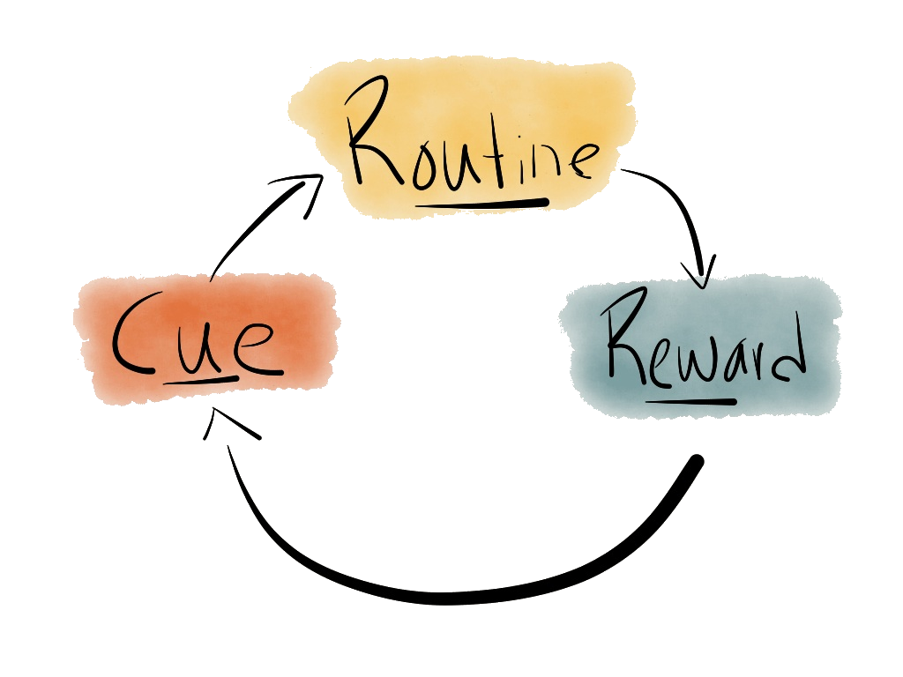

When training an artificial neural network, a simplified version[^1] of the classic workflow is:
1. Set up an neural network with randomly-weighted neurons
1. Feed an example from the training set into the network
1. Calculate the [difference between the actual and expected output](https://en.wikipedia.org/wiki/Loss_function)
1. Use [backpropagation](https://en.wikipedia.org/wiki/Backpropagation) to update the weights of all the neurons in the network
1. Go to #2 until you have processed the entire training set

A direct parallel can be drawn between this process and the habit formation described by Charles Duhigg in [The Power of Habit](https://g.co/kgs/xm7DuX). He describes habitual behaviour as a three-step process[^2]:

## What does this have in common with training a neural network?
To a single neuron, this is how training looks:
1. **Cue**: accept inputs from neurons in the previous layer
2. **Routine**: calculate the sum of the weighted inputs and apply the activation function
3. **Reward**: during backpropagation, update our input weights according to the loss function

In fact, the analogy also works at the level of the network as a whole:
1. **Cue**: transform our input example and input it into the first layer of the network
2. **Routine**: the network processes the input through its layers to produce a result
3. **Reward**: calculate how accurate the result is – compared to the labeling of the input example – and backpropagate

So, from a process perspective there do seem to broad similarities between how we – as humans – form habits, and how we perform supervised machine learning on neural networks.

## Generalising habits: System 1 thinking
In [Thinking, Fast and Slow](https://g.co/kgs/vM95DV), Daniel Kahneman draws a distinction between **System 1** and **System 2** thinking. The former is responsible for fast, cheap, lossy, inaccurate, and unconsious thought; the latter is responsible for analytical, reasoned, slow, expensive, and conscious thought.

Habits and habitual behaviour are archetypal examples of System 1 thinking: we can solve extraordinarily complex problems without even noticing it – for example driving a car while our mind wanders a little.

## Do neural networks behave like our System 1 thinking?
Some hallmarks of System 1 thinking are:
- it's very quick
- it happens unconsciously
- it's well-suited to searching for patterns
- it requires training through repetition and reward
- it gives simple answers to complex questions
- it's prone to cognitive errors

The similarities between these attributes and the behaviour of trained neural networks are striking.

Admittedly, I cherry-picked these attributes to _some_ degree but – apart from certain human-centric cognitive errors that we suffer from – it's hard to find a single characteristic of System 1 thinking which isn't also evident in artificial neural networks.

## What does this mean for machine cognition?
Kahneman doesn't imply that his System 1/2 abstraction represents an actual underlying psychophysiological distinction: both systems are powered by the same underlying hardware – neurons – after all. On the other hand, [fMRI experiments](https://theeconreview.com/2017/01/13/what-neuroscience-has-to-say-about-decision-making/) show that System 2 is associated with increased frontal and parietal cortex activity, so perhaps there really is a structural difference between the two systems.

Whether there is a physiological distinction between the systems or not, it seems clear that there is a wide spectrum along which cognition can happen – with System 1 at one end and System 2 at the other.

As described above, supervised machine learning looks to be at the same end of that spectrum as System 1: from both a process and behaviour perspective.

The two clearest conclusions from this are:

## 1. Artificial General Intelligence won't come from supervised machine learning
AGI is a dream or a nightmare depending on whom you talk to.

Either way, although supervised neural networks can take you deep into the [uncanny valley](https://en.wikipedia.org/wiki/Uncanny_valley), it seems like there will always be **something** missing if they just get better and better, faster and faster, at System 1-like responses.

## 2. We shouldn't expect neural networks to be able to explain their decisions
Yes, we could dump out the weights of all the neurons to fully "explain" a neural network. However, in the same way as performing that procedure on a human wouldn't "explain" their personality, we don't gain real insight from merely understanding the hardware.

There has been [some progress](https://arxiv.org/pdf/1612.04757v1.pdf) on generating commentary alongside a particular decision but its domain is very limited. Many leading AI researchers have shifted in recent years to focussing on the statistical outcomes of the AI and optimising there – rather than demanding a wholesale account of each individual decision.

Neural networks **just don't work** in a logical, considered way which can be dissected and analysed afterwards. There is no rational answer to be explained so it would behove us to stop asking the question.

[^1]: A more complete version of this would include careful selection of training, dev, and test sets, along with changes to the network architecture, hyperparameters, regularisation, … However, at its core, this simplified version is where the kernel of automated learning happens.
[^2]: I use Duhigg's formulation here rather than [James Clear's](https://jamesclear.com/habit-triggers) because I don't think splitting **Routine** into **Cue** and **Response** makes sense for neural networks.
[^3]: Cover photo by [Alina Grubnyak](https://unsplash.com/@alinnnaaaa?utm_source=unsplash&amp;utm_medium=referral&amp;utm_content=creditCopyText) on [Unsplash](https://unsplash.com/?utm_source=unsplash&amp;utm_medium=referral&amp;utm_content=creditCopyText)
