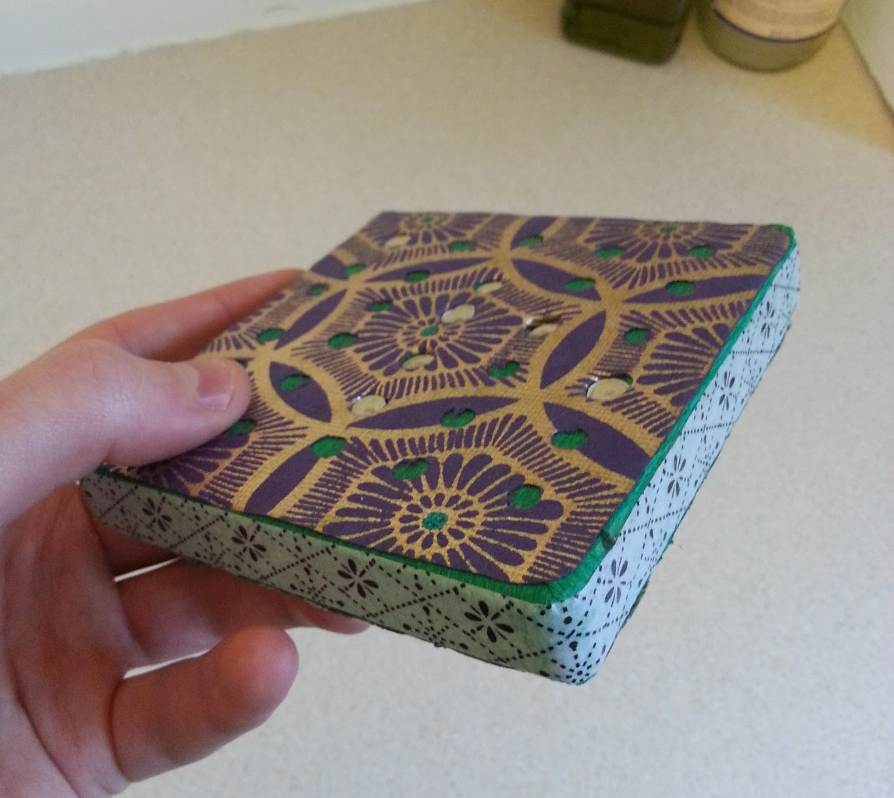
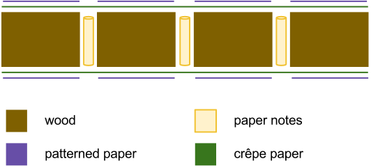
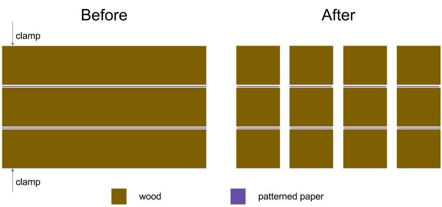

I was always told to prize gifts that people had put time and effort into.
Hoping my SO shared the same view, I decided to make her a little something for
her birthday.

Being creatively barren, I attempted plagiarism.

<!-- excerpt -->
I remembered seeing [this
Kickstarter
project](http://www.kickstarter.com/projects/leafcutterdesigns/retro-punch-boxes-for-valentines-day)
ages ago. It's based on an old parlour game: the idea is to conceal little
messages inside a nice-looking block, to be popped out with a pencil when the
recipient feels like it.

Now, that Kickstarter project is long since finished but I reckoned I could
have a pretty good go at making my own version. Here's what I ended up with so
you can decide whether to keep reading or not:

I know, it looks like shit doesn't it? Don't worry: they'll be blown away that
you made the effort &#x1f44c;.

# What you'll need

* three blocks of wood (I used 150mm × 150mm × 20mm, but up to you)
* crêpe paper
* two pieces of thick, patterned paper (the same size as the faces of the blocks, e.g. 150mm × 150mm in my case)
* [washi tape](http://www.cutetape.com/)
* glue (I used 3M spray mount)
* writing paper
* a drill and ~5mm bit (_ideally_ a drill press but not absolutely required)

# What we're aiming for

The structure of the block itself is really simple: it's just a square-ish cut
of wood with holes drilled through. Rolled up notes are inserted into these
cylindrical holes, and we stick crêpe paper on both faces to hold them in
place.

To make the object a bit more appealing, we'll add some patterned paper to the
top and bottom of the block, with holes pre-punched in it. This makes it easy
to see where the notes are hiding, and hence where the recipient should poke a
pencil to get one out.

Lastly, we'll use washi tape – basically patterned sticky tape – around the
edge, to keep the crêpe nice and tidy.

This shows a cross-section of the completed box:

# How to do it

## Creating the rolled up notes
1. **Cut the writing paper into strips**. I found that 210mm long strips (the
   width of A4 paper) can be rolled up to fit in a 5mm hole. They should be a
   couple of millimeters narrower than the wood; e.g. with 20mm thick wood, cut
   18mm wide strips.
1. **Write your notes on the paper strips**. I can't really help with this bit!
1. **Roll the notes up into tight spirals**. I set it up so that as they were
   unrolled, the message gradually appeared as written.

## Preparing the wood and patterned paper
What we're aiming for here is a wood block with holes drilled in it, and patterned paper with holes in it that
exactly match the layout of holes in the wood block.

To do that, we'll sandwich the wood and paper together (using two sacrificial
wood blocks to prevent tear-out) and drill holes in the wood block _and_
patterned paper at the same time. This guarantees the holes in your paper will
line up with the holes in the block.

1. **Cut out pieces of your patterned paper**. The pieces should be just big
   enough to cover the two largest faces of the block. Mark the paper and
   blocks to remember which one goes on which side.
1. **Layer your wood blocks and patterned paper**. Wood block, patterned paper,
   wood block, patterned paper, wood block (see below).
1. **Clamp the wood and paper**.
1. **Drill holes through the whole lot**. This is where a drill press would be
   really handy. If you don't have one, make sure your drilling at a
   perpendicular!

Here's how the wood-paper sandwich looks before and after drilling:

## Inserting the notes

1. **Glue crêpe on the bottom of the wood block**. Apply glue to the wood
   rather than the crêpe, so that you don't glue the crêpe to the notes
   accidentally. Don't use too much glue because excess will easily soak
   through the paper!
1. **Insert rolled notes into the holes in your wood**.
1. **Glue crêpe on the top of the wood block**. Again, apply glue to the wood
   rather than the crêpe.
1. **Stick washi tape round the edge of the block**. A sharp knife makes it
   easier to get the ends of the tape to sit close to each other without
   overlapping.
1. **Stick patterned paper on the top and bottom of the block**. Use the marks
   you made to ensure you have the right piece of paper, in the right
   orientation, on the right face.
1. **Leave to dry**.

To ensure that there wasn't an unsightly crêpe paper join at the edges of the
box, I cut the bottom piece of paper too big and wrapped the excess up and
around the sides of the box. That way the top piece of crêpe met and overlapped
with the bottom piece.
