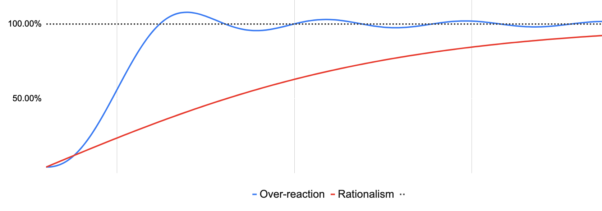

In [Can we pull back from the brink?](https://samharris.org/podcasts/207-can-pull-back-brink/), Sam Harris talks about the importance of level-headed and open-minded conversation as perhaps our only tool to acknowledge historical evils and find the best way to move forwards to a fairer society.

Despite being a huge admirer of Sam's work, and my genuine belief that in tackling this fraught topic he is doing his best to help in an extremely complex and difficult time, I think he's got it wrong here.

<!-- excerpt -->

Sam's approach – in this podcast and others, and in his books – is that the best way to arrive at a just and inclusive society is careful rationality and dispassionate debate. He warns against overreaction and moral panic almost as much as he condemns the injustices that trigger our reaction.

In 2018, his conversation with Rebecca Traister – [Is #MeToo Going Too Far](https://samharris.org/podcasts/141-metoo-going-far/) – provoked a similar response. In that podcast, they discussed cases like that of [Matt Damon getting blowback](https://www.vanityfair.com/hollywood/2018/01/matt-damon-hollywood-reckoning-apology) from his comments calling for a recognition of a spectrum of transgression.

As Rebecca said:

> what happened to Matt Damon is that people were mean to him on the Internet [...] I think people were angry because it was a sort of condescending misreading of the actual very nuanced and complicated conversation that was taking place

I'm sure that at the time it felt very unpleasant for Matt Damon to become a target for such anger – leading to him retracting the statements and "getting in the backseat" as he said. However, as Rebecca predicted then, [his career hasn't suffered at all](https://www.imdb.com/name/nm0000354/).

To Sam, the outcry seemed to be an unfortunate overreaction. To me, that seems fine: good, in fact. A public figure made poorly-considered and insensitive comments, got some flak, took them back, said sorry, and everything carried on. Perhaps there was some overreaction at the time – understandably, given many people extremely angry – but the actor's error was corrected quickly and there was no lasting damage.

Although we're still too early in the current Black Lives Matter protests to know how things will play out, I think the same principle applies here. I'm not pro-looting, of course, but I think we need to give the protesters on the streets some leeway because in the end **it will result in a quicker arrival at a better society**.

## Asymptotes and intersections
Let's say there is a mythical "100% perfect" society that we're aiming for.

If we aim for that perfect society, moving deliberately forward through a series of rational conversations and subsequent adjustments, we will make progress – that's not in doubt – but our movement towards perfection will never quite get us there (red line).

If instead, we allow for some over-correction and resets (blue line), then we converge on where we want to be much faster. Yes: some eggs will be broken during the making of the omelette. No: we'll never completely settle on the "100% perfect" society. But surely the rest of society can absorb a misplaced blow here and there in service of building a more equitable society as quickly as possible?
