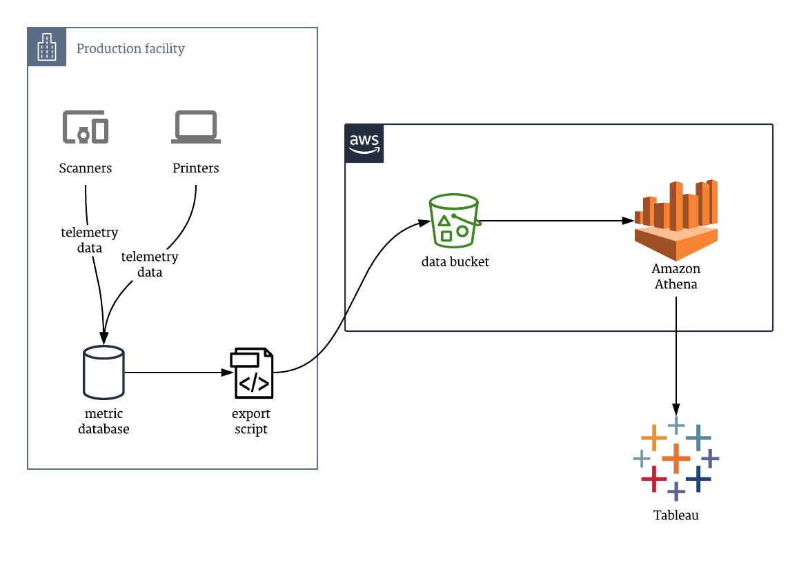

We use [Fivetran](https://fivetran.com/) and [Snowflake](https://www.snowflake.com/) for our ETL system and data warehouse at Teespring. They work well for the vast majority of our use cases, but we recently ran into an urgent problem where those tools couldn't help. This is the story of how we solved the issue with Athena and S3.

## Telemetry data in our production facilities
We gather a large amount of data about the flow of work through our production facilities. Who scanned which QR codes at what time? Which press was used by which person during what period, and how many items did they produce? What are our inventory levels for each SKU in each locations, and how many SKUs have been picked and are ready to enter the next phase of fulfillment?

We use those data internally to inform our decisions within the facility itself, but the data stays within the private network of the building – we had never needed to hook it out to Fivetran, Snowflake, Tableau, etc. to create dashboards for broader consumption.

When we saw that efficiency had dropped at our Kentucky plant, we therefore didn't have all of the data available in our usual analysis tools – it was trapped within the plant's private network.

## Liberating the inaccessible data
We had a few options to be able to munge and understand the data from our plant. These included:

1. Punching a hole through the plant firewall and allowing Fivetran to extract data directly from the databases.
1. Setting up a read replica outside of the firewall, and allowing Fivetran to pull data from there.
1. Setting up new tooling **inside** the firewall to extract and analyse the data there, rather than in Tableau.
1. Shuttle the data out of the facility and have it end up in Tableau through some other means.

Option #1 is recommended against [by Fivetran themselves](https://fivetran.com/docs/databases/mysql/setup-guide#allowportaccess) due to load on the master database.

Option #2 is pretty clearly _the right option_ here, but unfortunately it didn't work for us in this case. Setting up a new read replica in RDS is easy enough, but we knew from past experience that dumping all the data out of the plant's databases, loading that into the new replica, and having the replication catch-up would mean several hours of downtime. Our facility is running 24/7 at maximum capacity at the moment (hence why fixing this efficiency problem was so urgent!): hours of downtime was unacceptable.

Option #3 is workable, but stinks. We want to correlate these data with other information already in Tableau, and create holistic dashboards: we need these data out from behind the firewall.

So we're left with option #4. Despite my initial wariness, it was actually a good fit for our particular situation for a couple of reasons:

- We only care about recent data – stretching back a few weeks up to today. So, exporting the data and sending it somewhere outside the private network wasn't a crazy idea.
- We only cared about a narrow subset of the data – the production rate on the presses – so again, this made the manual export more reasonable.
- It turns out that Tableau [can pull data from Athena](https://www.tableau.com/about/blog/2017/5/connect-your-s3-data-amazon-athena-connector-tableau-103-71105), and Athena can pull from a wide variety of [data sources](https://docs.aws.amazon.com/athena/latest/ug/work-with-data-stores.html), in a variety of [data formats](https://docs.aws.amazon.com/athena/latest/ug/serde-reference.html). Athena was the key piece of technology that opened our eyes to the possibility of exporting data in a basic format (like CSV), getting it out of the private network, and still being able to work with it in really powerful ways.

## Setting up Athena
AWS claim that[^1]:

> Amazon Athena is an interactive query service that makes it easy to analyze data directly in Amazon Simple Storage Service (Amazon S3) using standard SQL. With a few actions in the AWS Management Console, you can point Athena at your data stored in Amazon S3 and begin using standard SQL to run ad-hoc queries and get results in seconds.

Now I like marketing claims as much as anyone, but the thing is: **this is actually true**☝️. In my mental model, text files lying around in S3 are _so far_ away from relational databases that I assumed there would be a painful setup process, or a confusing configuration step, or severe limitations on real-world use cases.

However, for us, it was truly as simple as dropping the CSVs into a bucket, manually creating a matching table schema (automatic data discovery and schema inference [is available](https://docs.aws.amazon.com/glue/latest/dg/add-crawler.html)), and starting to run SQL queries against the data in those CSVs.

Here's the `CREATE TABLE` statement which Athena creates automatically for you:

```sql
CREATE EXTERNAL TABLE `press_impressions`(
  `start_time` timestamp, 
  `press_id` int, 
  `press_name` string, 
  `operator_name` string, 
  `impression_count` int)
ROW FORMAT DELIMITED 
  FIELDS TERMINATED BY ',' 
STORED AS INPUTFORMAT 
  'org.apache.hadoop.mapred.TextInputFormat' 
OUTPUTFORMAT 
  'org.apache.hadoop.hive.ql.io.HiveIgnoreKeyTextOutputFormat'
LOCATION
  's3://out-bucket/data/our-folder'
```


## Hooking it all together
From here, it was as simple as creating a new Athena connection in Tableau and all of the data was available to to our analysts. We could create charts and dashboards in our usual tool chain, correlated against other metrics from other data sources, and quickly understand how to boost efficiency.



One note: we are trying to move to user-less authentication and authorization in IAM as much as possible, so it would be nice to have a role-based access option in Tableau, but it's not a deal-breaker for us.

Overall, I must admit I went into this project with great trepidation. I was already thinking about how I would manually generate charts from the exported CSV data if Athena turned out not to be as straightforward as it purported to be. However, I was pleasantly surprised – pleasantly astounded – that within minutes, it proved the marketing claims true: you just point it at an S3 bucket and you get a SQL interface back.

[^1]: https://docs.aws.amazon.com/athena/latest/ug/what-is.html
