The first step of my [swamp cooler project](/tags/swamp-cooler/) is to figure out the construction of the evaporative cooling vessel.

I'd like to use an upturned terracotta pot for the vessel itself, with air entering at the bottom, passing up the inside and out the drainage hole at the top.

Unlike the [Cold Pot](http://thibault-faverie.com/Cold-Pot) – which pushes air through a dry aluminium sleeve – I'm trying to maximise the surface area of wet terracotta which the incoming air passes over before emerging from the exhaust.

To do this, I'm thinking that encouraging the air to swirl up in a vortex could be a good approach. Not only does it mean the air spends more time in the cool interior, it will also be pushed against the damp vessel wall by the apparent centrifugal force.

I prototyped three different approaches:

## Beer can helter skelter

After a visit from from English friends, if there was one thing we had a lot of, it was empty beer cans.

I tried to put these to use by cutting out split ring shapes from the aluminium, and glueing them together into spirals that can be trained – with some fiddliness – into a helical shape.

  <figure class="five">
    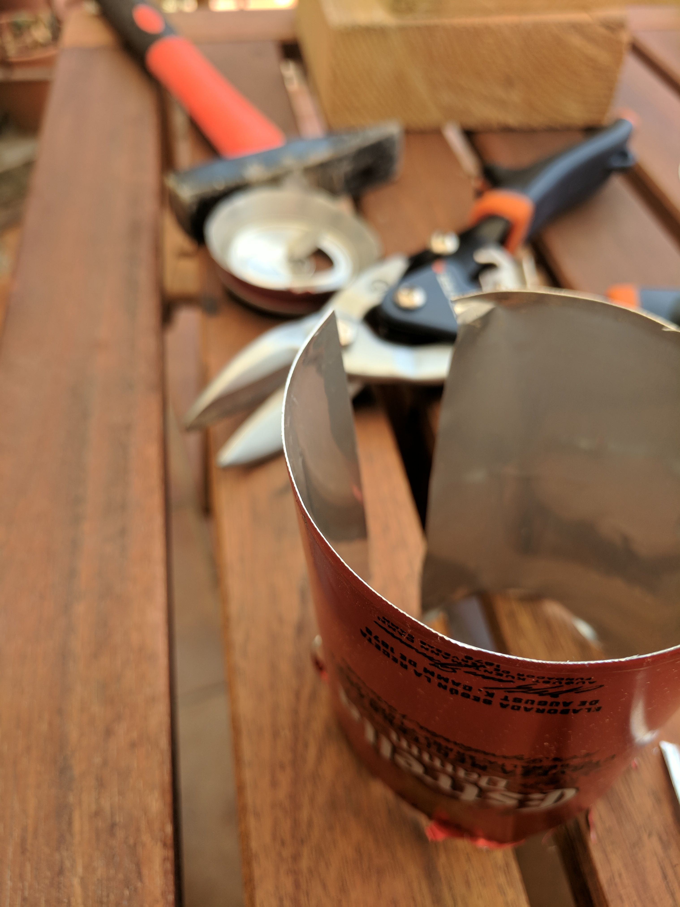
    <figcaption>Snip off the ends</figcaption>
  </figure>
  <figure class="five">
    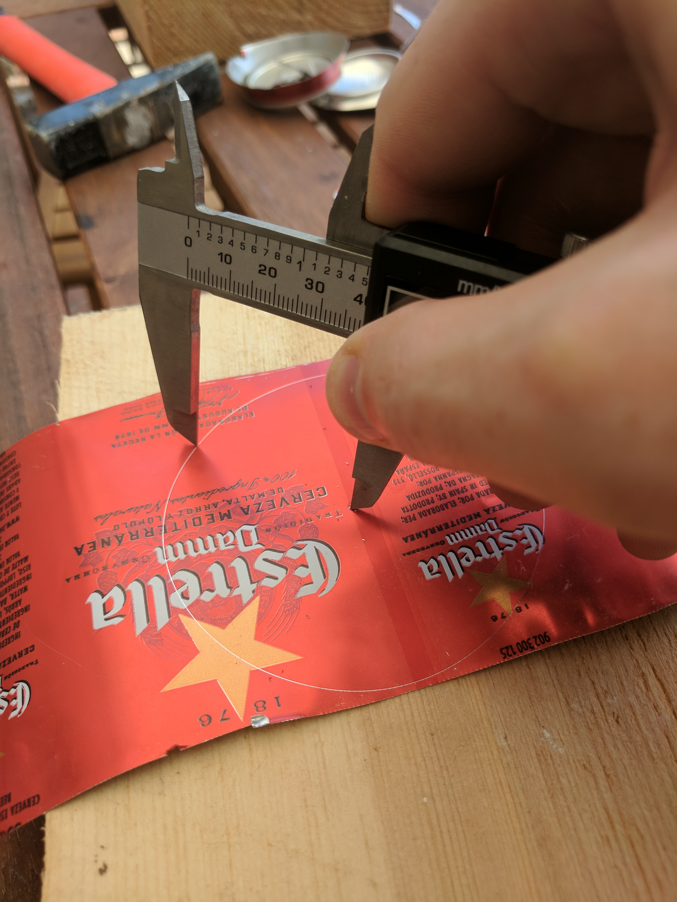
    <figcaption>Marking circles</figcaption>
  </figure>
  <figure class="five">
    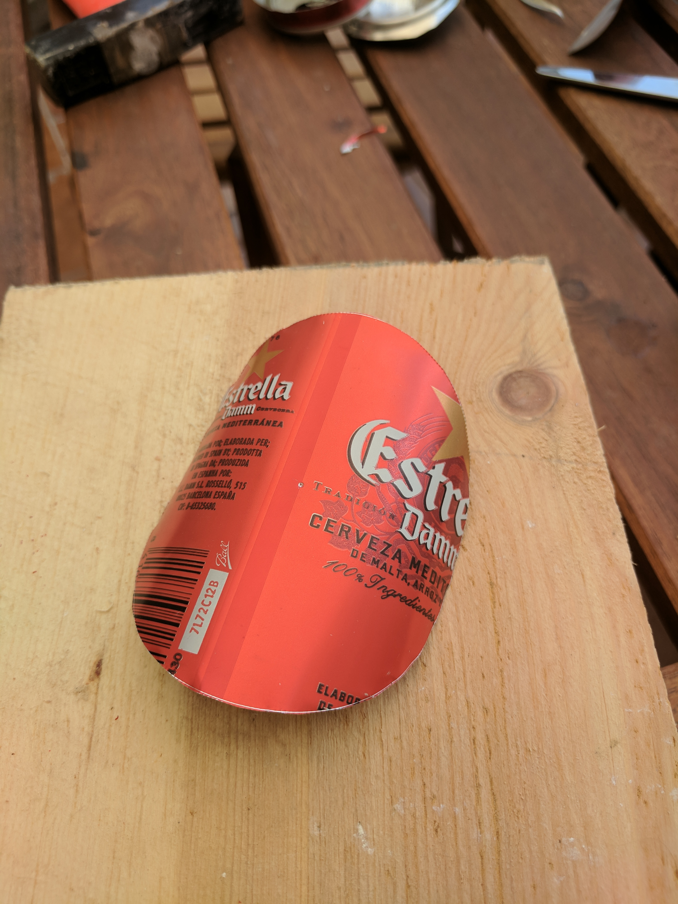
    <figcaption>I got two circles out of each can</figcaption>
  </figure>
  <figure class="five">
    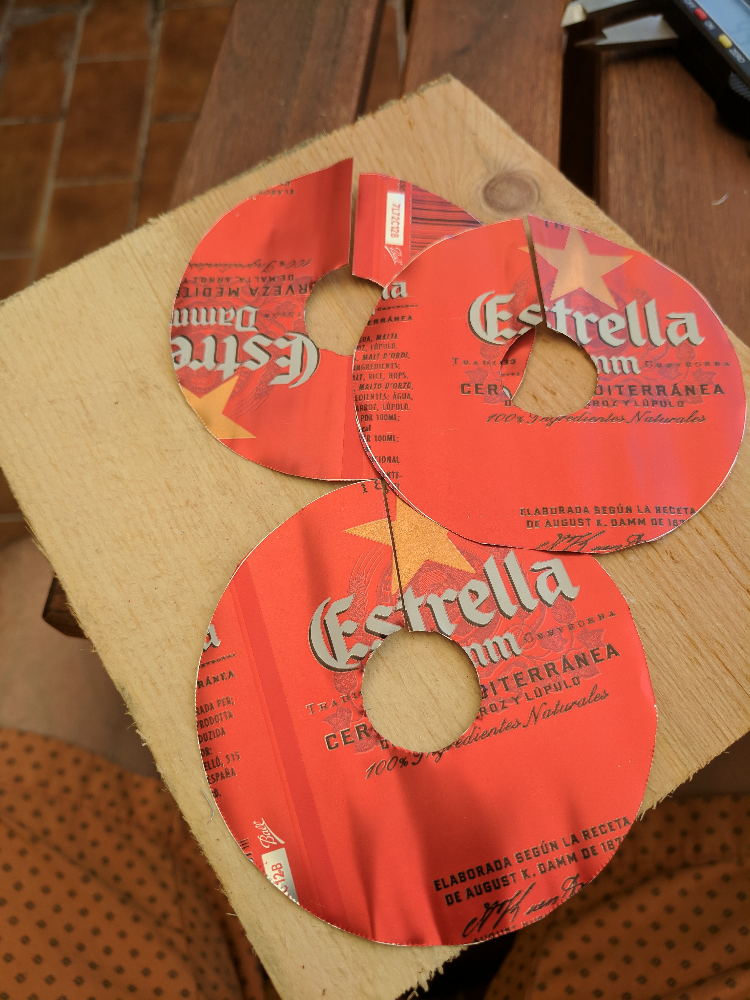
    <figcaption>Ring shapes with a split in them</figcaption>
  </figure>
  <figure class="five">
    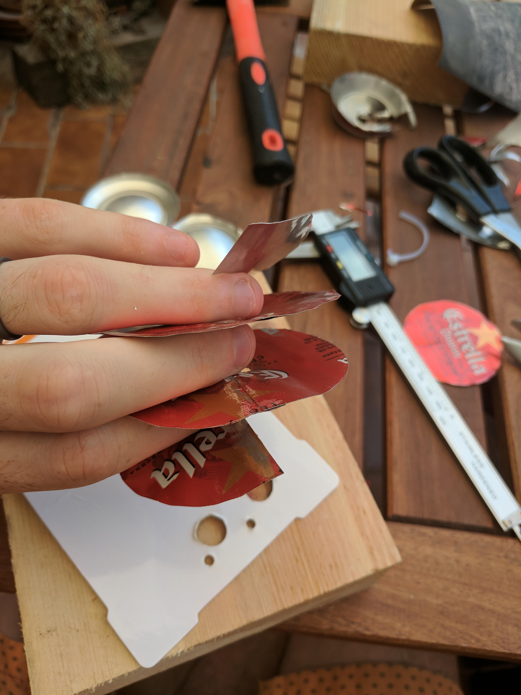
    <figcaption>Glued together into a helix</figcaption>
  </figure>
  

I would use spacers to hold the cans into an Archimedes screw shape. The air enters at the bottom, and runs up and up, round and round, until it reaches the exhaust hole.

Overall, I like that this method upcycles something we had lying around, and it's relatively easy to cut out the shapes as required.

However, getting the rings to hold the required shape is quite fiddly, and the maximum helical diameter is the height of the can, which means larger pots wouldn't work.

## Crinoline style

Another approach I considered was a wire cage – matching the internal shape of the pot – with tape criss-crossing it to swirl the air flow.

  <figure class="four">
    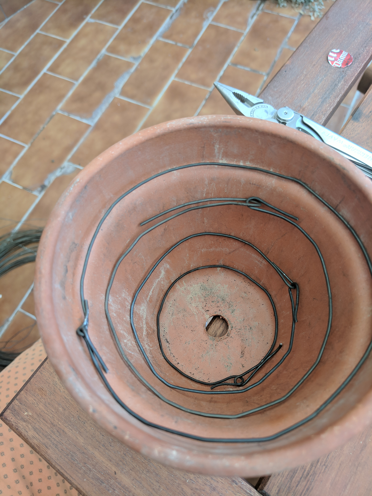
    <figcaption>Latitudinal wires</figcaption>
  </figure>
  <figure class="four">
    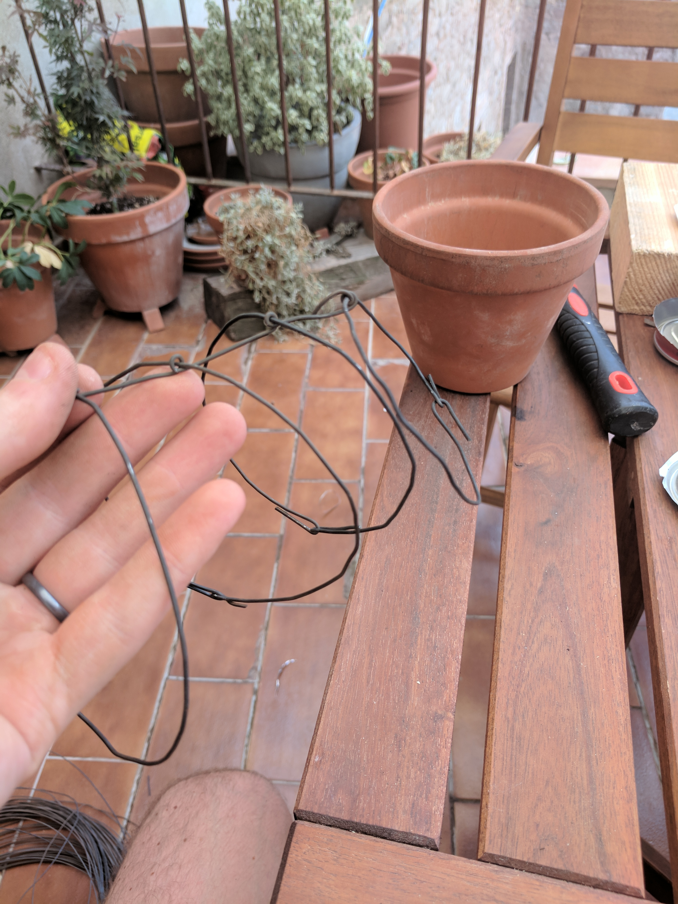
    <figcaption>Longitudinal spacers</figcaption>
  </figure>
  <figure class="four">
    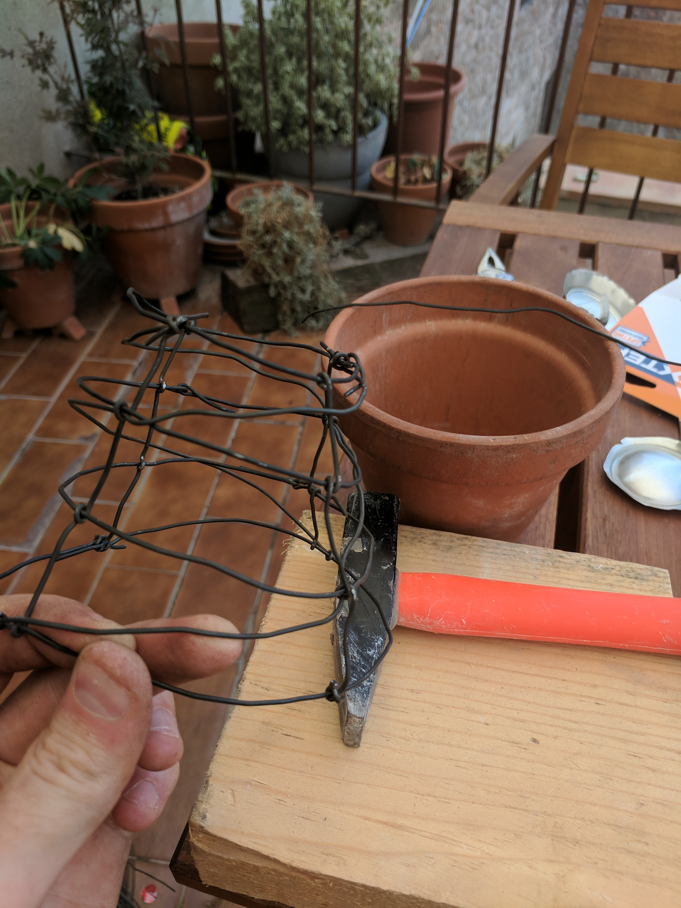
    <figcaption>Wires spiralling up the cage</figcaption>
  </figure>
  <figure class="four">
    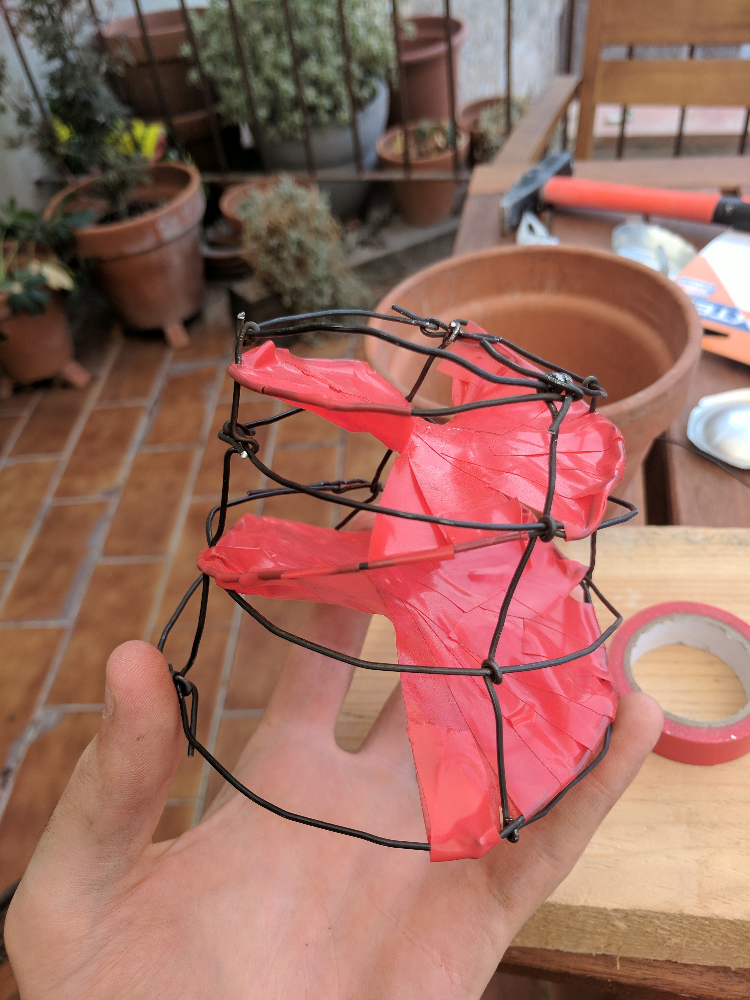
    <figcaption>Electrical tape to guide the air</figcaption>
  </figure>
  

When finished, it reminded me of the crinoline cages used to support Victorian ladies' skirts.

Unfortunately, this was incredibly fiddly to work with, and the tolerances were quite tight because the cage needs to match the internal form of the pot.

Additionally, I failed to realise beforehand that with this approach you can't construct helical paths for the air to follow from the bottom all the way to the top – the best I could do were these two single-turn helices on top of each other which I don't think would be so effective.

## Vaned discs

Finally, I cut discs out of some scrap metal we had lying around, and made partial radial cuts allowing me to form vanes.

  <figure class="four"></figure>
  <figure class="four">
    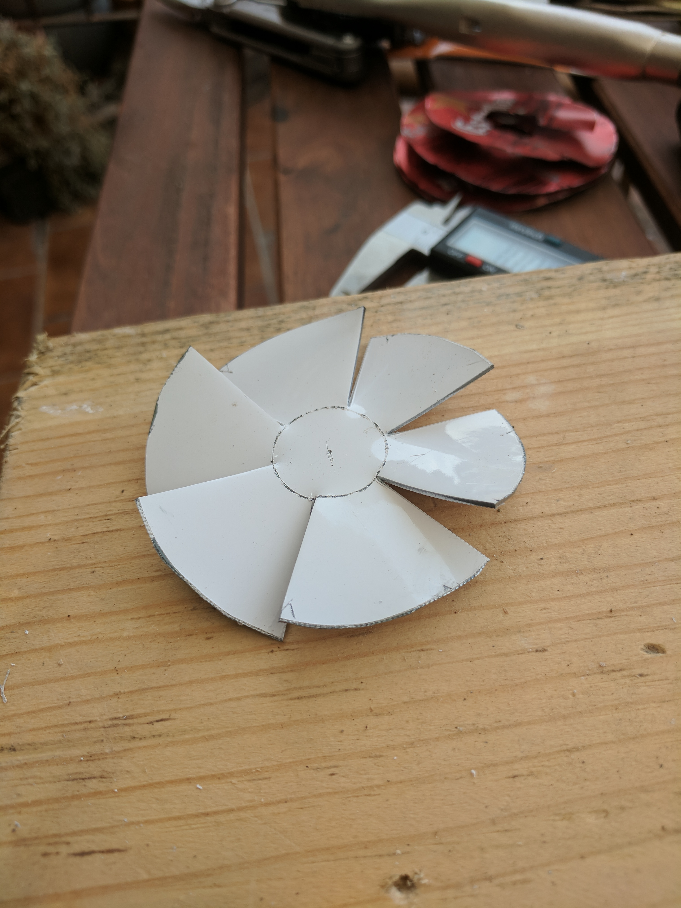
    <figcaption>One of the vaned discs</figcaption>
  </figure>
  <figure class="four">
    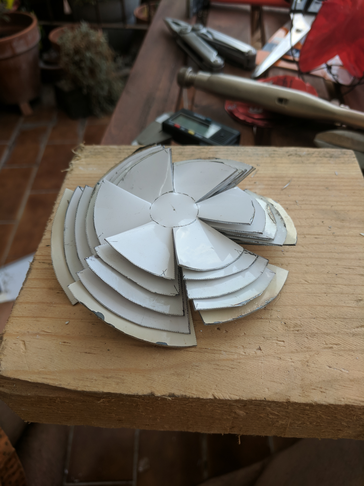
    <figcaption>A few vaned discs of different sizes</figcaption>
  </figure>
  <figure class="four"></figure>
  

I can mount these discs onto a threaded rod, with nuts to separate them at the right distance. I'm sure I could use that rod to mount it in place in the pot too.

It was a _pain_ to cut the discs out because the metal was a little too thick for my snips. Overall, though, this is my favourite approach because it's quite to make, easy to put together, applicable to pots of any size and easily adjustable.
